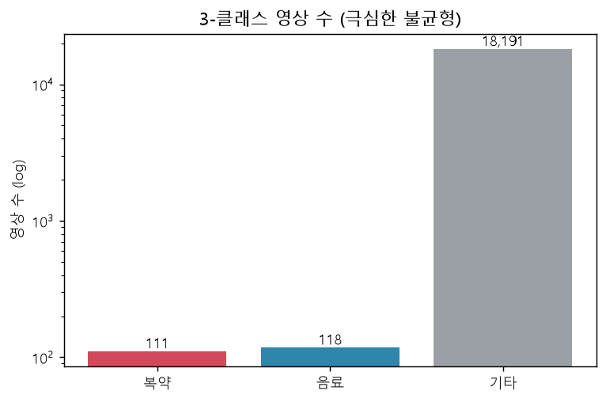
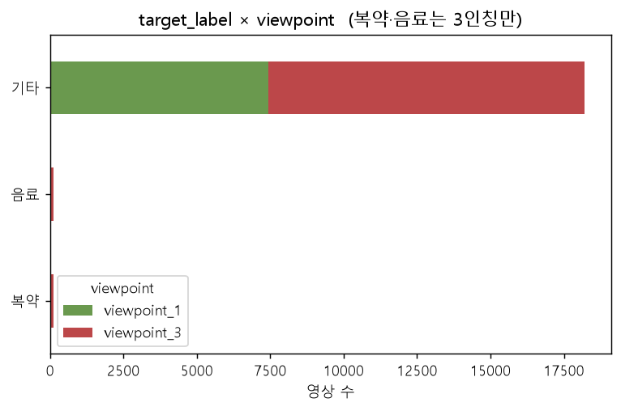
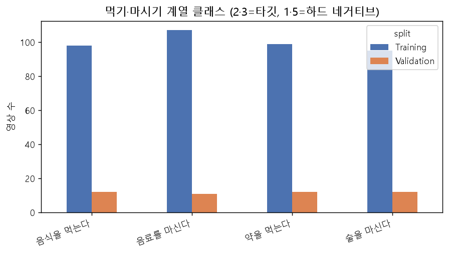
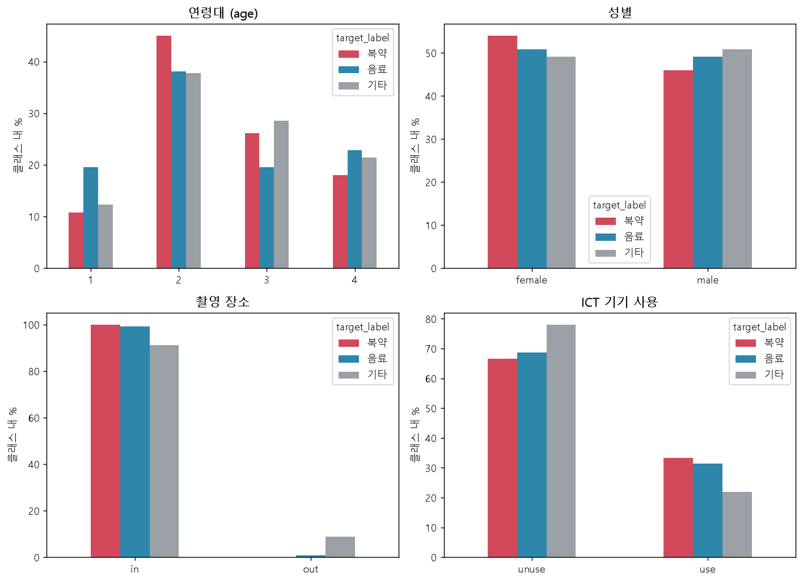
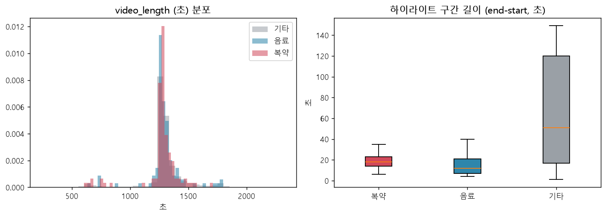
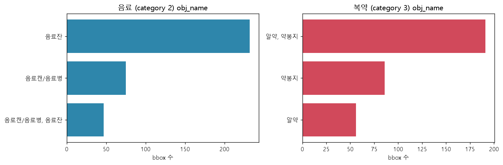
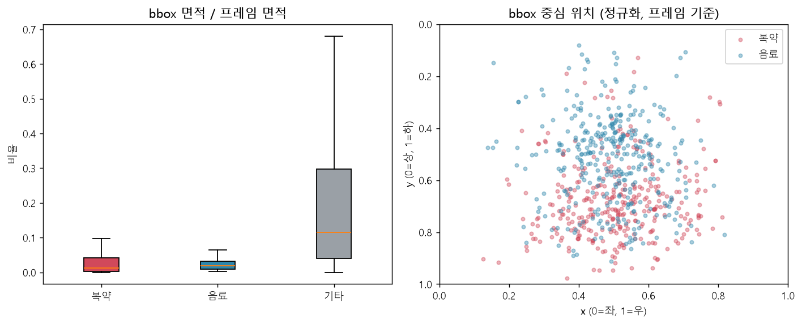

# EDA 리포트 — 복약 / 음료 / 기타 3-클래스 행동 분류

- **목표 모델**: 영상(또는 프레임)이 **① 복약 행동(약을 먹는다) / ② 물·음료 마시는 행동 / ③ 기타 그 외 행동** 중 무엇인지 분류
- **데이터**: `057.일상생활 영상 데이터` 로컬본 (`01.데이터/1.Training`, `01.데이터/2.Validation`). 구조 설명은 [AI-HUB 데이터 구조 안내](AI-HUB_데이터_구조_안내.md) 참조
- **분석 대상**: 라벨링데이터 전체 JSON **18,420건**(프레임 JPG 55,260장, bbox 55,558개). 원본 mp4·CSV 텍스트는 로컬에 없음
- 재현 스크립트: `scripts/` · 집계 산출물: `outputs/` · 그림: `figures/` · 샘플 프레임: `sample_frames/`
- 원본 EDA의 상세 CSV/TXT, 분석 scripts, sample frames는 데이터셋과 함께 로컬 EDA 작업 폴더에 보관하며, repository에는 문서 이해에 필요한 핵심 aggregate figure만 `docs/assets/eda/ai_hub/`에 포함한다.

> **클래스 매핑 주의**: 데이터셋에는 "물 마시기"만 떼어낸 클래스가 없습니다. 폴더명 번호 **2 = "음료를 마신다"(Drink_bever)** 를 "물·음료 마시기"의 프록시로 사용했습니다. 폴더명 번호 **3 = "약을 먹는다"(Take_pills)** 가 복약입니다. 그 외 103개 클래스는 전부 "기타"로 묶었습니다.

---

## 1. 요약 (핵심 발견 & 결론)

| # | 발견 | 모델링 함의 |
|---|---|---|
| 1 | **극심한 클래스 불균형** — 복약 111건(0.60%), 음료 118건(0.64%), 기타 18,191건(98.76%). 기타:복약 ≈ **164:1** | 클래스 가중치 / 포컬로스 / 기타 언더샘플링 필수. 절대량이 작아 k-fold CV·강한 증강·사전학습 백본 권장 |
| 2 | **복약·음료는 `viewpoint_3`(3인칭 고정)만 존재**. 1인칭 데이터 0건. 기타는 1인칭 7,432 + 3인칭 10,759 | 기타도 **viewpoint_3만** 사용해야 도메인 일치. 1인칭을 섞으면 모델이 "행동"이 아니라 "시점"을 학습 |
| 3 | **인접 행동이 시각적으로 거의 동일** — 5 "술을 마신다"(107건)는 음료와 마시는 동작이 같고, 1 "음식을 먹는다"(110건)는 손-입 동작이 복약과 유사 (원본 EDA 작업 폴더의 `figures/10_sample_contact_sheet.png`) | 이 두 클래스를 **하드 네거티브로 반드시 포함**. "술"을 음료에 병합할지("마시기" 225건) 정책 결정 필요 |
| 4 | **bbox 객체 라벨이 강한 판별 신호** — 음료: `음료잔`/`음료캔·병`(3종), 복약: `알약`/`약봉지`(3종). 기타에만 `전신` 라벨 1,836개 | 제공된 bbox 크롭 또는 객체 탐지기를 2차 신호로 활용 가능. 단 프레임당 bbox 1개뿐 |
| 5 | **행동 구간(timeline)이 타깃은 매우 짧음** — 복약 중앙값 18초, 음료 12초, 기타 46초. 영상 총길이는 세 그룹 모두 ≈21분으로 동일 | 원본 영상 확보 시 구간 중앙에서 프레임 샘플. 현재는 영상당 3프레임만 제공(구간 내 넓게 분산 샘플됨) |
| 6 | **피험자·배경 누수 위험** — 복약/음료 피험자 152명 전원이 "기타" 행동으로도 촬영됨. 같은 3인칭 고정카메라 = 같은 방·인물이 타깃/기타 양쪽에 노출 | `actor` 기준 분할 재구성 권장. 현행 Train/Val은 클래스 내 actor 교집합은 0이지만 인물·공간은 겹침 |
| 7 | **인구통계 편중** — 복약은 age2(20~39세)에 45% 집중, age1은 10.8%뿐. 타깃은 실내 ~100%, ICT 사용률(33%)이 기타(22%)보다 높음 | 연령대별 성능 분리 평가. 소수 셀(복약 age1 = 12건, age4 = 20건) 주의 |
| 8 | **데이터 품질 이슈** — `video_date` 오타 12건(`0021-*`,`2121-*`), `height==150` 기본값 의심 566건, `job` 한글 자유기입 996건. 파싱 오류·결측은 0 | 메타는 클렌징 후 사용. 영상/프레임 자체는 손상 없음 |

**권장 데이터 구성(출발점)**: `viewpoint_3` 한정 → 양성 = 복약(111) + 음료(118), 음성 = 술·음식 등 인접행동 전량 + 나머지 기타에서 층화 언더샘플링(예: 클래스당 15~30건씩) → 총 수천 건 규모. `actor` 겹치지 않게 5-fold. 프레임 단위(333 + 354장) 또는 3프레임 클립 단위 학습.

---

## 2. 데이터 개요

| 항목 | 값 |
|---|--:|
| 영상(JSON) | 18,420 |
| 프레임(JPG) | 55,260 (영상당 정확히 3장) |
| bbox(annotation) | 55,558 |
| 행동 클래스 | 105 |
| 피험자(actor) | 202 |
| JSON 파싱 오류 | 0 |

| split | viewpoint_1 | viewpoint_3 |
|---|--:|--:|
| Training | 6,617 | 9,786 |
| Validation | 815 | 1,202 |

전체 클래스별 건수 분포·순위는 `outputs/03_per_class_counts.csv`, [`assets/eda/ai_hub/09_all_class_counts.png`](assets/eda/ai_hub/09_all_class_counts.png).

---

## 3. 타깃 3-클래스 분포



| 클래스 | Training | Validation | 합계 | 프레임 | 비율 | 기타 대비 |
|---|--:|--:|--:|--:|--:|--:|
| 복약 (cat 3) | 99 | 12 | **111** | 333 | 0.60% | 1 : 163.9 |
| 음료 (cat 2) | 107 | 11 | **118** | 354 | 0.64% | 1 : 154.2 |
| 기타 (그 외 103클래스) | 16,197 | 1,994 | **18,191** | 54,573 | 98.76% | — |

- Training:Validation 비율은 세 클래스 모두 대략 9:1(데이터셋 기본 분할 그대로).
- 복약·음료의 **절대 건수가 100건대**로 매우 작음 → 단일 hold-out 검증(복약 Val 12건)으로는 성능 분산이 큼. **교차검증 필수**.

### 3-1. viewpoint 편중 (도메인 일치)



| target_label | viewpoint_1 | viewpoint_3 |
|---|--:|--:|
| 복약 | 0 | 111 |
| 음료 | 0 | 118 |
| 기타 | 7,432 | 10,759 |

→ 복약·음료는 **3인칭 고정 시점 전용**. 기타를 그대로 다 쓰면 40%가 1인칭(전혀 다른 화면 구성)이라 모델이 시점 자체로 클래스를 가를 수 있음. **기타는 `viewpoint_3`(10,759건)로 제한**하는 것을 기본값으로. (제한해도 여전히 복약과 97:1)

---

## 4. 인접·혼동 클래스 (먹기·마시기 계열)

 · 표: `outputs/04_near_classes.csv`

| 폴더# | 행위 | Training | Validation | 합계 | 이 EDA에서의 취급 |
|--:|---|--:|--:|--:|---|
| 1 | 음식을 먹는다 | 98 | 12 | 110 | 기타(**하드 네거티브** — 손→입, 복약과 유사) |
| 2 | 음료를 마신다 | 107 | 11 | 118 | **음료(양성)** |
| 3 | 약을 먹는다 | 99 | 12 | 111 | **복약(양성)** |
| 5 | 술을 마신다 | 95 | 12 | 107 | 기타(**하드 네거티브** — 마시는 동작이 음료와 사실상 동일) |

원본 EDA 작업 폴더의 `figures/10_sample_contact_sheet.png`에서 육안 확인:
- 술(5) 프레임: 유리잔·머그로 마시는 장면 → 음료(2)와 구분 단서가 **음료 종류(맥주캔 등)** 뿐.
- 음식(1) 프레임: 젓가락/포크로 입에 가져감 → 복약(3)의 "손으로 알약을 입에" 동작과 형태 유사. 구분 단서는 **알약/약봉지 존재 여부**.

→ 학습 시 음성 표본에 클래스 1·5를 **우선 포함**하고, 검증 지표를 "복약 vs 음식", "음료 vs 술"로 나눠 본다.

---

## 5. 인구통계 · 촬영 조건

 · 전체 수치: `outputs/05_demographics_pct.csv`, `outputs/06_region_by_class.csv`

각 셀 = **해당 클래스 내 비율(%)**. (기타는 viewpoint_3 한정)

| 필드 | 복약 | 음료 | 기타(v3) | 메모 |
|---|---|---|---|---|
| 성별 female / male | 54 / 46 | 51 / 49 | 49 / 51 | 복약이 약간 여성 쪽 |
| **연령 age1 / 2 / 3 / 4** | 11 / **45** / 26 / 18 | 20 / 38 / 20 / 23 | 12 / 38 / 29 / 21 | **복약이 age2(청장년)에 편중, age1 최소** |
| 장소 in / out | **100 / 0** | 99 / 1 | 91 / 9 | 타깃은 사실상 전부 실내 |
| 동반자 alone / partner | 91 / 9 | 92 / 8 | 90 / 11 | 차이 미미 |
| **ICT 사용 use** | **33** | **31** | 22 | 타깃 촬영에 기기 사용(폰 등)이 더 흔함 → 배경에 기기 노출 잦음 |
| 촬영장비 gopro | 68 | **75** | 64 | 음료는 iOS폰 촬영 거의 없음(0.8%) |
| 신장(cm) | min150 / 평균167 | min140 / 평균166 | — | `150`은 기본값 의심(9장 참조) |

- **지역**: 복약·음료가 소수라 17개 시·도에 2~15건씩 흩어짐(Gyeonggi 최다 13.5%, Jeju 1.8%). 지역 층화는 사실상 불가 → 지역은 성능 슬라이스 정도로만.
- 직업(`job`)은 코드값 + 한글 자유기입 혼재 → 피처로 쓰기 부적합. `outputs/07_job_by_target.csv`

---

## 6. 영상 길이 · 행동 구간

 · 표: `outputs/08_length_stats.csv`

| target_label | video_length 중앙값(초) | timeline 구간 길이 중앙값(초) | 구간 길이 평균 |
|---|--:|--:|--:|
| 복약 | 1,280 | **18** | 21.0 |
| 음료 | 1,281 | **12** | 20.7 |
| 기타 | 1,282 | 46 | 59.0 |

- 영상 총길이는 세 그룹 동일(≈21분) — 길이는 판별 정보 없음.
- **실제 행동(하이라이트) 구간은 타깃이 훨씬 짧다**(10~20초 vs 46초). 원본 영상을 확보해 프레임을 추가 추출한다면 `timeline.start~end` **중앙 구간**에 집중해야 함. 현재 제공되는 3프레임은 구간 내에서 넓게 분산 샘플됨(인덱스 spread 중앙값 96).

---

## 7. 어노테이션(bbox) 분석 — 보조 신호 후보

### 7-1. obj_name (bbox가 가리키는 객체)

 · CSV: `outputs/09_objname_cls02_음료.csv`, `outputs/09_objname_cls03_복약.csv`

| 음료 (cat 2, bbox 354개, 3종) | 복약 (cat 3, bbox 333개, 3종) |
|---|---|
| 음료잔 232 / 음료캔·음료병 75 / (둘 다) 47 | 알약,약봉지 191 / 약봉지 86 / 알약 56 |

- 두 클래스 모두 **객체 어휘가 3종으로 매우 깔끔** → "알약/약봉지" vs "잔/캔/병"은 강력한 판별 단서.
- 기타 상위 obj_name: `옷`, `전신`, `바늘,천`, `카드/화투`, `공,손` … (top30: `outputs/09_objname_기타_top30.csv`)
- **`전신`(사람 전체) bbox: 복약 0 / 음료 0 / 기타 1,836** — 3인칭 전신 라벨은 기타에만 존재.

### 7-2. bbox 기하

 · 표: `outputs/10_bbox_geometry.csv`

| target_label | 면적/프레임 (평균) | 면적/프레임 (중앙값) | 중심 x | 중심 y | 폭×높이(px) | 프레임 전체 bbox 비율 |
|---|--:|--:|--:|--:|--:|--:|
| 복약 | 0.032 | 0.012 | 0.51 | **0.68** | 221 × 204 | 0% |
| 음료 | 0.031 | 0.018 | 0.49 | 0.52 | 193 × **273** | 0% |
| 기타 | 0.222 | 0.115 | 0.51 | 0.54 | 666 × 525 | 3.5% |

- 타깃 bbox는 작다(프레임의 1~3%)·프레임 전체를 덮는 경우 없음.
- **복약 bbox는 화면 하단(y≈0.68)**, 거의 정사각(손+약을 테이블 근처에서) / **음료 bbox는 화면 중앙, 세로로 길쭉**(잔을 든 손~팔이 세로로) → 위치·종횡비도 약한 단서.
- 영상당 annotation 수: 복약·음료는 **항상 정확히 3개**(프레임당 1개). 기타는 대부분 3, 일부 4~6.

---

## 8. 프레임 샘플링

- `n_images` = 모든 영상에서 정확히 **3**.
- 프레임 인덱스(원본 영상 내 위치) 최대값: 중앙값 157, 최대 481. 3장의 인덱스 spread 중앙값 96 → **구간 시작/중간/끝 근처로 흩어져** 샘플된 것으로 보임(연속 3프레임 아님).
- 따라서 "짧은 클립"보다는 **서로 떨어진 3장(멀티뷰/멀티프레임) 입력**에 가까움. 3D-CNN보다 프레임별 2D-CNN + 시간 풀링/어텐션이 현실적.
- 상세: `outputs/11_frame_index_spread.csv`

---

## 9. 데이터 품질 · 이상치

| 항목 | 내용 | 산출물 |
|---|---|---|
| `video_date` 비정상 | 2021년이 아닌 값 **12건**(`0021-08-04`, `2121-11-08` 등 연도 오타) | — |
| `height` 기본값 의심 | `150` 이 전체 **566건**(복약 2, 음료 4). 최소 140~최대 187 | — |
| `job` 자유기입 | 비표준 한글 값 10종·996건(`강사`, `작가`, `6급공무원합격후발령대기중` 등) | `outputs/07_job_by_target.csv` |
| `explan` | 중앙값 15자, 24%가 10자 미만("약을먹었습니다" 수준) — 텍스트 피처로는 빈약 | — |
| `categories.name` 혼재 | 폴더 63·101번에서 영문명 2종(타깃 클래스 아님) | `outputs/scan_log.txt` |
| 결측치 | 주요 컬럼(actor/gender/age/region/place/length/timeline) **0건** | `outputs/12_missing_values.csv` |
| 파일 무결성 | JSON 파싱오류 0, 프레임 해상도 전량 1920×1080 | `outputs/scan_log.txt` |

→ 메타 필드는 클렌징(날짜 12건 보정/제외, height 150 의심치 결측 처리) 후 사용. 이미지·라벨 본체는 정상.

---

## 10. Train/Val 분할 & 누수 점검

표: `outputs/13_split_leakage.csv`

| 점검 | 결과 |
|---|---|
| `video_id`(촬영 세션) Train∩Val | **0** — 동일 영상이 양쪽에 들어가는 문제는 없음 |
| `actor`(피험자) Train∩Val 전체 | 201 (Training 201명 전원이 Validation에도 등장) |
| 복약 클래스 내 actor Train∩Val | 0 (Train 98명 / Val 12명, 겹침 없음) |
| 음료 클래스 내 actor Train∩Val | 0 (Train 107명 / Val 11명) |
| 복약 Val 피험자 12명이 Training(다른 행동 포함)에 등장 | **12 / 12** |
| 음료 Val 피험자 11명이 Training(다른 행동 포함)에 등장 | **11 / 11** |
| 복약·음료 피험자(152명) 중 "기타" 행동으로도 촬영된 인원 | **152 / 152** |

**해석**: 같은 클래스 안에서는 Train/Val 피험자가 분리돼 있어 "동일 인물의 같은 행동"이 양쪽에 있지는 않다. 하지만 (a) 모든 타깃 피험자가 기타 행동으로도 등장하고, (b) viewpoint_3는 고정 카메라라 **방 구조·인물 외형이 그대로 노출**되므로, 3-클래스 모델이 "행동" 대신 "누구/어느 방"을 외워 검증 점수가 낙관적으로 나올 수 있다.
→ **`actor` 기준으로 완전히 분리된 분할**을 새로 만들고(특정 피험자 전체를 검증셋으로), 가능하면 그 결과를 주 지표로 삼는다.

---

## 11. 모델링 권장 사항 (정리)

1. **클래스 정의 확정**: "물 마시기" ← `음료를 마신다`(2). `술을 마신다`(5)를 (a) 음료에 병합("마시기" 225건) 또는 (b) 하드 네거티브로 유지 — 배포 시 "약 복용 감지"가 목적이면 (b), "마시는 행동 감지"가 목적이면 (a).
2. **도메인 통일**: 학습·평가 모두 `viewpoint_3`만. 1인칭 데이터는 이 과제에서 제외(또는 별도 실험).
3. **불균형 대응**: 기타를 층화 언더샘플링(클래스 다양성 유지). 클래스 가중치 ≈ 역빈도, 또는 focal loss. 양성:음성 = 대략 1:5~1:20 수준으로 맞추고 임계값은 검증셋에서 조정.
4. **하드 네거티브**: 음성 셋에 `음식을 먹는다`(1), `술을 마신다`(5), 그리고 손-입/컵 사용이 잦은 `전화통화`(69)·`이를 닦는다`(7)·`양치·세수` 계열을 우선 포함.
5. **데이터 증강**: 타깃이 100건대이므로 좌우반전·색·크롭·CutMix 등 적극. ImageNet/Kinetics 사전학습 백본 고정→미세조정.
6. **입력 형태**: 프레임 단위 2D-CNN(샘플 333+354장) 또는 영상당 3프레임을 세트로 넣고 시간 풀링. 3프레임은 연속이 아니라 분산 샘플임에 유의.
7. **보조 신호**: 제공 bbox 크롭(알약/약봉지 vs 잔/캔/병) 또는 소형 객체 탐지기의 출력(클래스·개수)을 late-fusion. `전신` bbox는 기타 판별에만 유효.
8. **평가**: `actor` 분리 5-fold. 지표는 macro-F1 + 클래스별 PR-AUC. 슬라이스: 연령대(age1~4), 성별, "vs 술"/"vs 음식" 혼동.
9. **메타 클렌징**: `video_date` 12건, `height==150` 566건 전처리. `explan`/`job`은 피처 제외.
10. **한계 명시**: 복약 age1 12건·age4 20건 등 소수 셀은 성능 신뢰구간이 넓음. 지역 편중으로 일반화 주장 시 주의.

---

## 부록 A. 산출물 목록

### `outputs/` (집계 CSV/TXT)
| 파일 | 내용 |
|---|---|
| `records.csv` | 영상 1건 = 1행 (스캔 원본, 30개 컬럼) |
| `annotations.csv` | bbox 1개 = 1행 (기하·obj_name 포함) |
| `scan_log.txt` | 파싱 오류·categories.name 혼재 로그 |
| `01_3class_distribution.csv` | 3-클래스 × split 건수 |
| `02_target_by_viewpoint.csv` | target_label × viewpoint |
| `03_per_class_counts.csv` | 105개 클래스 × split × viewpoint 건수 |
| `04_near_classes.csv` | 먹기·마시기 계열 4클래스 |
| `05_demographics_pct.csv` | 복약/음료/기타 인구통계 비율(7개 필드) |
| `06_region_by_class.csv` | 지역 × 클래스 |
| `07_job_by_target.csv` | 직업 × 타깃 |
| `08_length_stats.csv` | video_length / timeline_len 기술통계 |
| `09_objname_*.csv` | obj_name 빈도 (음료 / 복약 / 기타 top30) |
| `10_bbox_geometry.csv` | bbox 면적·중심·종횡비·전체프레임비율 |
| `11_frame_index_spread.csv` | 3프레임 인덱스 spread 통계 |
| `12_missing_values.csv` | 주요 컬럼 결측 수 |
| `13_split_leakage.csv` | Train/Val 누수 점검 수치 |
| `eda_summary.txt` | 02 스크립트 콘솔 출력 전체 |

### `figures/`
`01_3class_distribution` · `02_near_classes` · `03_viewpoint_composition` · `04_length_distributions` · `05_objname_targets` · `06_bbox_geometry` · `07_demographics` · `08_region_targets` · `09_all_class_counts` · `10_sample_contact_sheet` (.png)

### `sample_frames/`
클래스별 대표 피험자 5명 × 3프레임 원본 JPG:
`cls03_복약(약을 먹는다)` / `cls02_음료(음료를 마신다)` / `cls00_기타-술을 마신다(하드네거티브)` / `cls00_기타-음식을 먹는다(하드네거티브)` / `cls00_기타-임의행동`

## 부록 B. 재현 방법

```bash
cd EDA_복약_음료_분류/scripts
python 01_scan_dataset.py      # 라벨링데이터 전수 스캔 → outputs/records.csv, annotations.csv
python 02_eda.py               # 집계 표 → outputs/*.csv, outputs/eda_summary.txt
python 03_figures.py           # → figures/01~09
python 04_sample_frames.py     # → sample_frames/*, figures/10
```
의존: `python 3.12`, `pandas`, `numpy`, `matplotlib`, `openpyxl`. 경로·클래스 정의는 로컬 EDA 작업 폴더의 `scripts/common.py` 참조.
